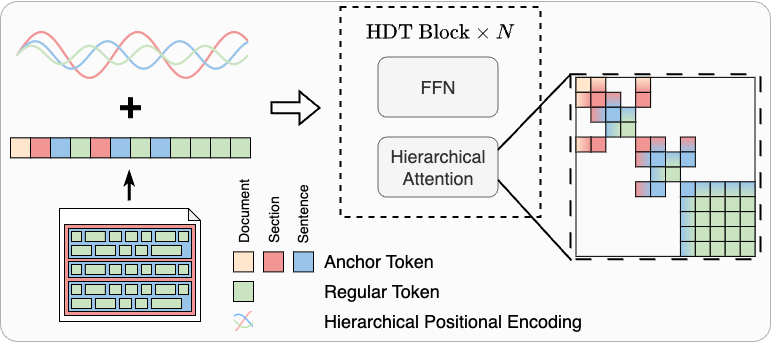

# HDT: Hierarchical Document Transformer
This repository contains code for our COLM'24 paper "HDT: Hierarchical Document Transformer" [[PDF]]() 
##   📖 Overview
We present HDT, a novel sparse Transformer architecture tailored for structured hierarchical documents. HDT exploits document structure by introducing auxiliary anchor tokens and redesigning the attention mechanism into a sparse multi-level hierarchy. By developing a novel sparse attention kernel that considers the hierarchical structure of documents, HDT achieves computational efficiency as well as higher sample efficiency for pre-training and better performance on downstream tasks.  


## 🌟 Requirements
The required Python packages for running this repo are listed in [requirements.txt](./requirements.txt). To install these pacakages at one time, plaese run
```shell
pip install -r requirements.txt
```

## 📊 Datasets
For pre-training, we collect structured documents from [HUPD](https://huggingface.co/datasets/HUPD/hupd), [unarXive](https://github.com/IllDepence/unarXive), and WikiPedia. We further preprocess the documents according to the 3-level hierarchy we define in the paper, so that each document is composed of a list of sections, which is a list of sentences. 
### Pre-training Data

In our implementation, a document is structured as a list of sections, where each section is a list of sentences. This hierarchical format allows the HDT model to efficiently process and exploit the structural information present in the document.

Here is an example representation of the document data structure:

```python
document = [
        [
            "Title",
            "Abstract",
            "This is the first sentence of abstract.",
            "This is the second sentence of abstract.",
            ...
        ],
        [
            "Introduction",
            "This is the first sentence of the introduction.",
            ...
        ],
    ...
]
```

To download the preprocessed data, run

```python
from datasets import load_dataset

unarxive = load_dataset('howey/unarXive')
hupd = load_dataset('howey/hupd')
wikipedia = load_dataset('howey/wiki_en')
```

### FullTextSciRepEval
In our experiments, we extend the [SciRepEval](https://arxiv.org/pdf/2211.13308) with public accessible arxiv full-text data, leading to a subset called [FullTextSciRepEval](https://huggingface.co/datasets/howey/super_scirep) including full-text scientific papers and labels from SciRepEval. FullTextSciRepEval is used to benchmark long document representation in our paper.  

## 🚀 Training
The pre-training for HDT uses [pretrain.py](./pretrain.py). Note that both training of encoder-only model and encoder-decoder model shares the same training script, with different arguments setting. For instance, training a HDT encoder-only model (HDT-E) on Masked Language Modeling (MLM) task, you should run
```shell
python pretrain.py --encoder_only --tok_name google-bert/bert-base-uncased
```
Here we directly use the BERT tokenizer for simplicity. We pre-train our models in an academic budget following [CRAMMING](https://arxiv.org/abs/2212.14034). As default, the models are trained on 1 GPU for 24 hours. 

In addition, to pre-train an encoder-decoder model for generation tasks with multiple gpus for longer time budget (e.g., 48 hours), run   
```shell
python pretrain.py --tok_name google-t5/t5-base --num_layers 6 --num_decoder_layers 6 --num_gpus 4 --budget 48 
```
> [!NOTE]  
> - We uses [UL2](https://arxiv.org/abs/2205.05131) as the pre-training objective for encoder-decoder model and MLM for encoder-only model, following the default configuration from the original papers.
> - Anchor tokens [DOC], [SEC], and [CLS] are not masked during pre-training.

## Available Models on [](https://huggingface.co/howey)

| Model Name                                                                                            | Encoder Layers | Decoder Layers |  Hidden Units | Attention Heads | Vocab  | Parameters |
|-------------------------------------------------------------------------------------------------------|----------------|-----------|---------------|-----------------|--------|------------|
| [`howey/HDT-E`](https://huggingface.co/howey/HDT-E)                                                   | 12             |           | 768            | 12              | 32,768 | 109M       |
| [`howey/HDT-ED`](https://huggingface.co/howey/HDT-ED)                                               | 6              | 6              | 768       | 12              | 32,128 | 112M       |

## 🧩 ListOps
To verify our hierarchical attention, we start experiments on [ListOPs](https://arxiv.org/abs/1804.06028) before training on language tasks using the scripts in [ListOPs](./ListOPs). 
The entry point is `run_experiment.py`. You can provide model names and hyperparameters as command line arguments. 
For example, to run the HDT vs BERT vs HAT vs Longformer experiment we used in the paper:  
```shell
cd ListOPs
python run_experiment.py 0.25 5 20 90000 12 128 1 512 300 120 0.0003 fixed blue 512 HDT hdt_testrun
python run_experiment.py 0.25 5 20 90000 12 128 1 512 300 120 0.0003 fixed blue 512 BERT bert_testrun
python run_experiment.py 0.25 5 20 90000 12 128 1 512 300 120 0.0003 fixed blue 512 Longformer Longformer_testrun
python run_experiment.py 0.25 5 20 90000 12 128 1 512 300 120 0.0003 fixed blue 512 HAT HAT_testrun
```
> [!NOTE]
> Because our customized attention kernel only supports three-level hierarchy currently, we don't use it for the ListOps tasks where the depths could be much larger, e.g., 20. We create hierarchical attention mask and directly apply the mask on the attention score matrix. A more flexible kernel will be released soon which supports arbitrary levels of hierarchy.

## 📚Citation
If you use or extend our work, please consider citing our paper. Thank you for your support! 🥰
```
@misc{He2022COLM,
  author = {He, Haoyu and Flicke, Markus and Buchman, Jan and Gurevych, Iryna and Geiger, Andreas},
  title = {HDT: Hierarchical Document Transformer},
  publisher = {Conference on Language Modeling},
  year = {2024},
}
```

